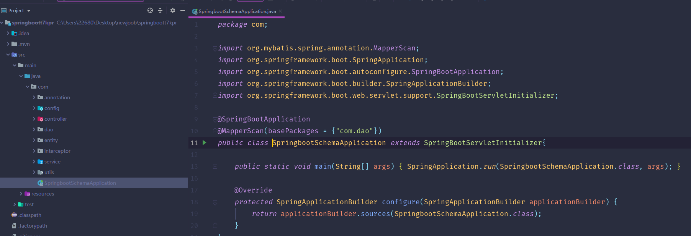
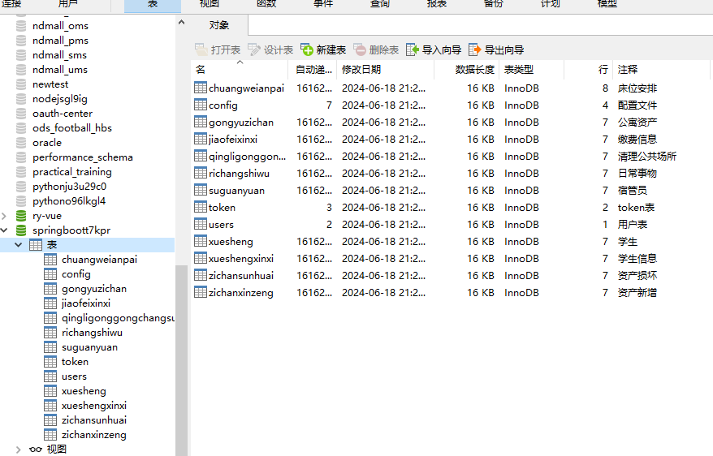
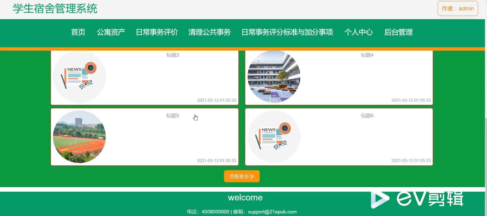
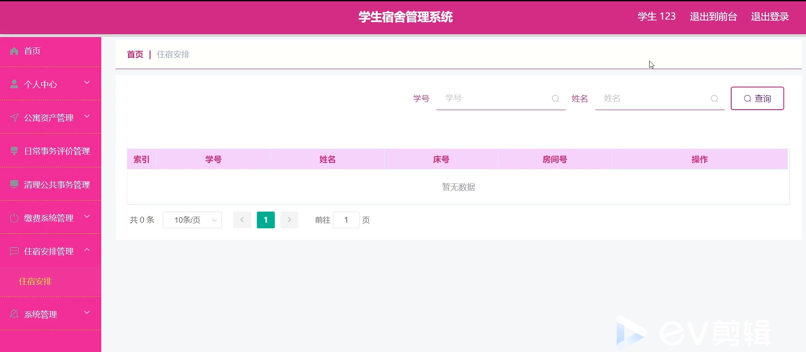
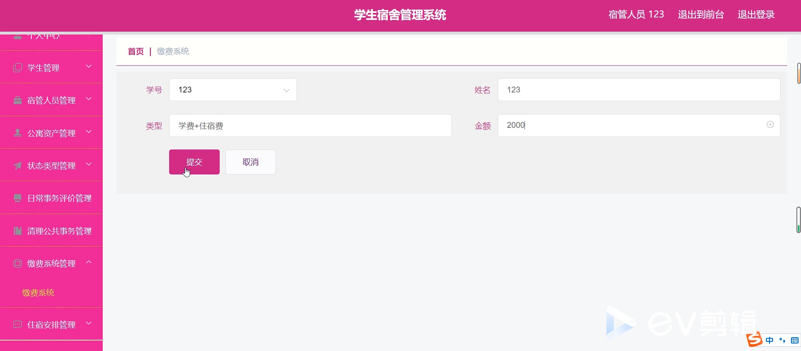
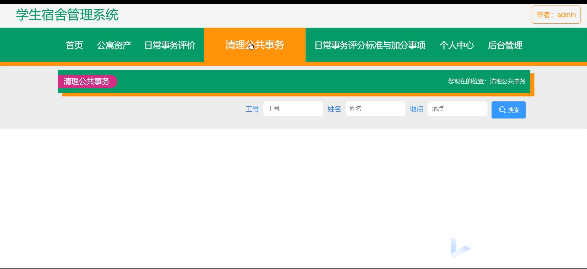
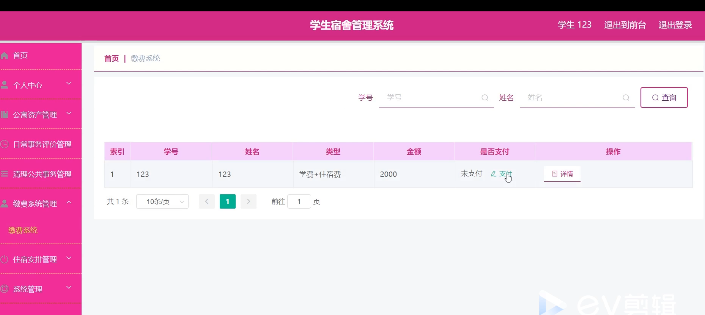
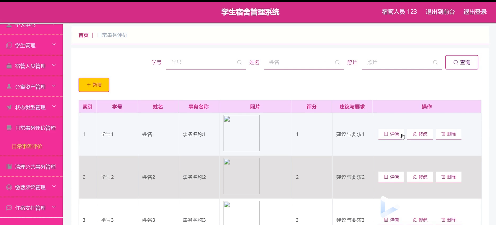

# 基于Springboot的学生宿舍管理系统的设计与实现

<h4 style='color:red'>联系不到我，就看我的主页 </h4> 
 
#### 介绍
学生宿舍管理系统是一个专门为高校宿舍管理设计的综合性平台，旨在提高宿舍管理的效率，提升学生住宿体验。系统分为管理端、宿管人员端和学生端三个角色，每个角色都有特定的功能模块，方便各自的操作和管理。通过该系统，各角色能够高效地完成各自的任务，促进宿舍管理工作的顺利进行。

#### 技术栈介绍

后端技术栈：Springboot+Mysql+Maven

前端技术栈：Vue+Html+Css+Javascript+ElementUI

开发工具：Idea+Vscode+Navicate

#### 系统功能介绍

管理端功能模块

学生管理：管理员可以查看和管理学生信息，包括学生的入住、退宿、信息更新等操作。

宿管人员管理：管理员可以管理宿管人员的信息，包括宿管人员的分配、工作任务、绩效考核等。

公寓资产管理：管理员可以管理宿舍内的资产信息，包括资产的添加、删除、更新以及维修记录等。

状态类型管理：管理员可以定义和管理各种状态类型，例如宿舍的维修状态、卫生状态等。

日常事务评价管理：管理员可以查看和管理日常事务的评价信息，了解学生对宿舍环境和服务的反馈。

清理公共事务管理：管理员可以管理公共事务的清理工作，确保宿舍的公共区域保持整洁。

缴费系统管理：管理员可以管理学生的缴费信息，包括住宿费、水电费等的缴纳和查询。

住宿安排管理：管理员可以安排和调整学生的住宿，确保宿舍资源的合理分配。

系统管理：管理员可以进行系统设置和维护，确保系统的稳定运行和安全性。

宿管人员端功能模块

学生管理：宿管人员可以查看和管理所负责宿舍楼的学生信息，包括入住情况和退宿安排。

宿管人员管理：宿管人员可以查看和管理自己的信息和工作任务，进行日常工作记录。

公寓资产管理：宿管人员可以记录和管理宿舍内的资产信息，及时上报损坏和维修需求。

状态类型管理：宿管人员可以记录和更新宿舍状态，包括卫生检查、维修记录等。

日常事务评价管理：宿管人员可以查看学生对日常事务的评价，改进服务质量。

清理公共事务管理：宿管人员可以安排和执行公共区域的清理工作，确保环境整洁。

缴费系统管理：宿管人员可以协助学生查询和缴纳费用，记录缴费情况。

住宿安排管理：宿管人员可以协助管理员安排学生住宿，处理宿舍调整申请。

系统管理：宿管人员可以查看和更新系统中的相关信息，保证数据的准确性。

学生端功能模块

公寓资产：学生可以查看自己宿舍内的资产信息，了解宿舍设施情况。

日常事务评价：学生可以对宿舍的日常事务和服务进行评价，提出意见和建议。

清理公共事务：学生可以查看和参与公共区域的清理工作，维护宿舍环境。

日常事务评分标准与加分事项：学生可以了解宿舍管理的评分标准和加分事项，积极参与宿舍管理和维护。

个人中心：学生可以查看和更新个人信息，包括联系方式、入住信息等。

后台管理：

公寓资产管理：学生可以报告宿舍内资产的损坏情况，提出维修请求。

日常事务评价管理：学生可以查看自己的评价记录和反馈结果。

清理公共事务管理：学生可以查看和参与公共事务的管理和记录。

缴费系统管理：学生可以查询和缴纳住宿相关费用，查看缴费记录。

住宿安排管理：学生可以查看自己的住宿安排，申请宿舍调整。

系统管理：学生可以查看系统公告和通知，了解宿舍管理的最新信息。

#### 系统作用

对管理端的作用

高效管理：通过系统，管理员可以高效地管理学生、宿管人员、公寓资产等信息，提升宿舍管理的效率。

全面监督：系统提供了全面的监督和管理功能，管理员可以及时了解宿舍的各项事务和状态，确保宿舍管理的规范和透明。

提升服务质量：通过日常事务评价管理和清理公共事务管理，管理员可以及时获取学生的反馈，改进服务质量，提升学生满意度。

对宿管人员端的作用

简化工作流程：宿管人员可以通过系统简化日常工作流程，提高工作效率，减少手工记录的繁琐。

实时信息更新：宿管人员可以实时更新和查看宿舍信息，及时处理学生的需求和问题。

提升服务水平：通过日常事务评价和反馈，宿管人员可以了解学生的需求和意见，改进服务质量。

对学生端的作用

便捷查询：学生可以通过系统方便地查询宿舍内的资产信息、缴费信息和住宿安排，减少不必要的沟通成本。

参与管理：学生可以通过评价和反馈功能积极参与宿舍管理，提出意见和建议，提升宿舍生活质量。

透明公开：系统提供透明的管理和服务信息，学生可以及时了解宿舍的各项事务和状态，增强信任感。

#### 系统功能截图

代码结构

数据库表

登录

首页

学生端后台管理

宿管人员端

清理公共事务

个人中心

缴费系统管理

日常事务评价

#### 总结

学生宿舍管理系统通过分角色设计，为管理端、宿管人员端和学生端提供了全面的功能模块。管理端高效的学生和宿管人员管理、公寓资产管理和缴费系统管理功能，以及全面的评价和反馈管理功能，为宿舍的规范运营提供了保障；宿管人员端便捷的工作记录和信息管理功能，提升了宿舍服务质量和工作效率；学生端丰富的信息查询和参与管理功能，提升了学生的住宿体验和满意度。系统通过友好的用户界面和全面的功能设计，为高校宿舍管理提供了高效、便捷的综合解决方案，促进了宿舍管理工作的顺利进行。

#### 使用说明

创建数据库，执行数据库脚本 修改jdbc数据库连接参数 下载安装maven依赖jar 启动idea中的springboot项目

后台地址：http://localhost:8080/springboott7kpr/admin/dist/index.html

管理员  abo 密码 abo

前台地址：http://localhost:8080/springboott7kpr/front/index.html